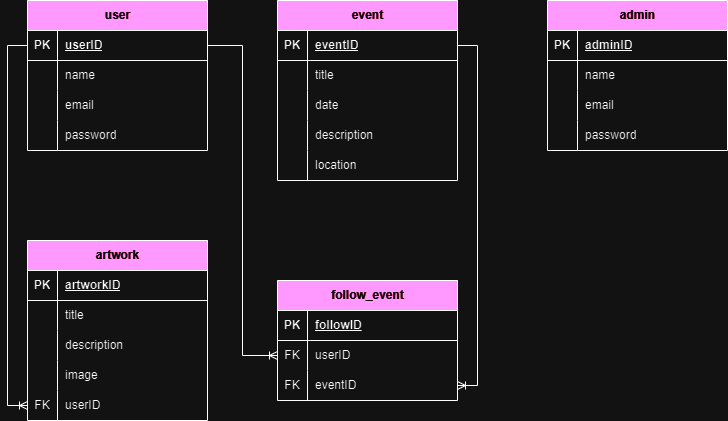

# ArtLocal API
"ArtLocal" adalah sebuah API yang memiliki tujuan utama untuk mempromosikan, memfasilitasi, dan merayakan seni dan budaya lokal dengan pendekatan yang mudah diakses bagi pengguna. API ini didesain untuk mendukung seniman, budayawan, serta komunitas lokal dalam membagikan karya seni dan kebudayaan mereka kepada audiens yang lebih luas.

## Instalasi
Cara instalasi:
1. Clone repositori ini ke komputer anda dengan perintah: 
```bash
  git clone [URL Repositori] 
```
2. Instal semua dependensi yang diperlukan dengan menjalankan perintah:
```bash
  go mod tidy 
``` 
3. Salin file .env.example menjadi .env dan konfigurasikan informasi koneksi database MySQL di dalamnya.
4. Jalankan API dengan perintah: 
```bash
  go run main.go 
``` 
5. Ini akan memulai server API, dan API akan berjalan di http://localhost:8080 secara default. Pastikan tidak ada konflik port dengan layanan lain yang berjalan pada port 8080.

## Penggunaan
Anda dapat menggunakan API ini untuk berbagai keperluan seperti melihat, mencari dan mengunggah acara(event) serta karya seni(artwork) dan lainnya. Sebelum Anda dapat mengakses endpoint-endpoint API Art Local, Anda perlu melakukan otentikasi dengan token JWT. Untuk mendapatkan token, Anda dapat mengirim permintaan POST ke endpoint otentikasi dengan kredensial pengguna Anda. Pastikan untuk mengamati dokumentasi endpoint di bawah ini.

## Documentation

Untuk informasi lebih lanjut tentang penggunaan dan dokumentasi lengkap API Art Local, silakan kunjungi [Art Local Documentation](https://documenter.getpostman.com/view/23382236/2s9YXcdQ8H). Di sana, Anda akan menemukan panduan lengkap yang membantu Anda memahami cara menggunakan API ini, menjalankan permintaan, dan mengintegrasikan Art Local dengan proyek Anda.

## Desain
Berikut adalah skema desain ERD yang digunakan:



## Lisensi
Tentang Lisensi: Proyek ini didistribusikan di bawah [Lisensi MIT](https://choosealicense.com/licenses/mit/), yang memberi Anda kebebasan untuk menggunakan, menggandakan, memodifikasi, dan mendistribusikan kode sumber ini. Lisensi MIT mempromosikan kerjasama, pembagian pengetahuan, dan dukungan kepada komunitas pengembang. Kami mendorong Anda untuk menjelajahi dan berkontribusi pada proyek ini sesuai dengan ketentuan yang ada dalam lisensi.
